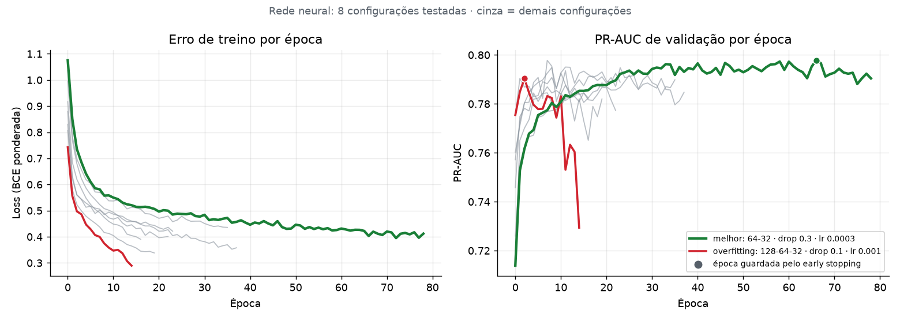

# Assistente de Churn B2B

Prevê quais clientes de uma distribuidora vão **parar de comprar**, explica **por quê**, busca nas políticas da empresa **o que pode ser feito** (RAG) e, nas próximas etapas, gera o plano de ação com LLM e coloca tudo em produção (MLOps).

> Dados **100% fictícios**, simulados para uma distribuidora de alimentos do oeste do Paraná (2.500 clientes, ~190 mil pedidos, 30 meses).

```
[Pedidos, atendimentos, cadastro] ─> Atributos por cliente ─> Modelo de churn ─> SHAP (motivos)
                                                                             │
[Políticas de retenção] ─> RAG (ChromaDB) ──────────────────────────────────┼─> LLM: plano de ação
                                                                             │
                                FastAPI + Docker + MLflow + GitHub Actions + Evidently (drift)
```

## Status

| Etapa | Conteúdo | Status |
|---|---|---|
| 1 | Dados, atributos, 3 modelos comparados, MLflow, SHAP | ✅ concluída |
| 2 | RAG: 10 políticas de retenção, ChromaDB, busca por tema e avaliação | ✅ concluída |
| 3 | LLM (LangChain) + API FastAPI + tela Streamlit | ⏳ |
| 4 | MLOps: Docker, GitHub Actions, deploy, monitoramento de drift | ⏳ |

## O problema: churn em B2B não tem "cancelamento"

Cliente de distribuidora não cancela contrato: ele **vai comprando menos até sumir**. Por isso a definição é:

> **Churn** = cliente ativo (comprou nos últimos 90 dias) que **não compra nos 90 dias seguintes**.

O modelo olha o retrato do cliente numa data e responde: *qual a chance de ele parar de comprar no próximo trimestre?*

## Etapa 1: resultados

Divisão **temporal** (treino em 2024-25, validação e teste em períodos posteriores que o modelo nunca viu), para simular o uso real.

| Modelo | PR-AUC teste | ROC-AUC teste | Lift top 10% | Recall top 10% |
|---|---|---|---|---|
| Rede neural (PyTorch) | 0,725 | 0,926 | 7,1× | 71% |
| LightGBM | 0,737 | 0,926 | 7,5× | 75% |
| Regressão logística | 0,709 | 0,925 | 7,1× | 71% |

**O que isso quer dizer na prática:** olhando só os 10% de clientes com maior risco, a equipe comercial encontra cerca de **3 em cada 4 clientes que vão sair**.

**Decisões e aprendizados**

- **PR-AUC como métrica principal**: só ~8% dos clientes saem por trimestre, e a acurácia enganaria.
- **A rede neural venceu na validação, mas o LightGBM foi melhor no teste.** Os três ficaram próximos, um resultado comum em dados tabulares. A escolha é feita pela validação, para não "espiar" o teste, e a comparação completa fica registrada no MLflow.
- **Calibração (Platt)**: o treino usa pesos para a classe rara, o que infla as probabilidades. Depois de calibrar, "risco de 30%" significa ~30% de chance real (Brier 0,041).
- **Sem vazamento**: há um teste automatizado que altera dados futuros e garante que os atributos não mudam.
- **Explicações conferidas**: como os dados são simulados, existe o gabarito da causa real. Em **87%** dos churns de teste com causa conhecida (entrega, preço ou financeiro), a causa real aparece entre os 3 motivos que o SHAP aponta.


### Treino × validação: detectando overfitting



Gráfico gerado automaticamente a cada treino (`python -m churn_b2b.treinar`). A configuração em **vermelho** continua baixando o erro de treino, mas a PR-AUC de validação despenca logo depois do pico: é **overfitting**. O early stopping interrompe o treino e recupera os pesos da melhor época (●). A configuração em **verde** teve a melhor validação e foi a escolhida entre as redes neurais.

> Os números podem variar um pouco entre computadores (inicialização aleatória e versões das bibliotecas), mas o padrão se repete.

### Exemplo de saída (`data/scores_atuais.csv`)

| Cliente | Risco | Motivos |
|---|---|---|
| C00700 · Mercearia · Palotina | Alto | Atraso médio de pagamento de 16 dias · Última compra há 69 dias |
| C01699 · Hotel · Cascavel | Alto | Última compra há 81 dias · Atraso médio de pagamento de 19 dias · Só 1 pedido em 90 dias |

Cada motivo recebe um **tema** (entrega, preço, financeiro, produto, engajamento, relacionamento, canal), que na Etapa 2 vai buscar a política de retenção certa no RAG.

## Etapa 2: RAG com as políticas de retenção

O modelo diz **quem** está em risco e **por quê**. O RAG responde **o que a empresa permite fazer** para reter esse cliente, buscando o trecho certo nas políticas internas.

**Base de conhecimento** (`politicas/`): 10 políticas fictícias da distribuidora, escritas com regras concretas (alçadas de desconto, prazos de entrega por cidade, renegociação de dívida, cadência de reativação, ofertas por segmento etc.). Cada política tem no cabeçalho os **temas** e os **segmentos** a que se aplica.

**Como funciona**

1. Cada política é fatiada por seção (41 trechos), vira vetor (embeddings) e vai para o **ChromaDB**.
2. Para cada cliente em risco, a consulta é montada com o perfil e os **motivos do SHAP**.
3. A busca é **semântica + filtro por metadados**: só entram políticas do **tema principal** do cliente (ex.: financeiro) e válidas para o **segmento** dele (ex.: restaurante). Um segundo tema também é consultado.
4. As **regras gerais** (prazos por faixa de risco, o que nunca fazer) vão sempre junto.

```
C00700 · Mercearia · Palotina · risco Alto
  • Atraso médio de pagamento de 16 dias
  • Última compra há 69 dias
Tema principal: financeiro
[POL-02] Crédito, cobrança e renegociação de prazo › Quando usar
[POL-02] Crédito, cobrança e renegociação de prazo › Opções de renegociação
[POL-02] Crédito, cobrança e renegociação de prazo › Primeiro contato
[POL-04] Programa de reativação de clientes que estão comprando menos › Quando usar
```

**Avaliação do recuperador**: 22 perguntas com a política correta definida à mão (`politicas/perguntas_avaliacao.json`).

| Embeddings | Filtro por tema | Acerto@1 | Acerto@3 | MRR |
|---|---|---|---|---|
| Local (n-gramas, sem API) | não | 73% | 95% | 0,84 |
| Local (n-gramas, sem API) | sim | 95% | 100% | 0,98 |
| OpenAI `text-embedding-3-small` | sim | *rode `python -m churn_b2b.rag.avaliar --comparar`* | | |

**Aprendizado:** o filtro por metadados (tema vindo do SHAP) pesa mais do que o modelo de embedding. É ele que leva o acerto@1 de 73% para 95%, porque o modelo de churn já diz *qual* é o problema e a busca só precisa achar a regra certa dentro daquele assunto.

## Como rodar

```bash
python -m venv .venv
.venv\Scripts\activate            # Windows  (Linux/Mac: source .venv/bin/activate)
pip install -r requirements.txt

python -m churn_b2b.simulacao      # gera os dados em data/            (~10 s)
python -m churn_b2b.treinar        # treina e compara os modelos       (~1 min)
python -m churn_b2b.pontuar        # pontua a carteira atual + motivos (~15 s)

# Etapa 2 — RAG (crie um arquivo .env com OPENAI_API_KEY=sk-... ou use --embeddings local)
python -m churn_b2b.rag.base               # indexa as políticas no ChromaDB
python -m churn_b2b.rag.contexto C00700    # risco + motivos + políticas de um cliente
python -m churn_b2b.rag.avaliar --comparar # acerto@1, acerto@3 e MRR (local x OpenAI)
pytest                             # testes

mlflow ui --backend-store-uri sqlite:///mlflow.db   # abre http://localhost:5000
```

## Estrutura

```
churn_b2b/
  config.py       datas de corte, caminhos, MLflow
  simulacao.py    gera clientes, pedidos e atendimentos (com causas de churn e drift proposital)
  features.py     retrato do cliente na data de corte + rótulo (sem vazamento)
  modelos.py      regressão logística, LightGBM, rede neural PyTorch (early stopping), calibração
  treinar.py      busca de hiperparâmetros, MLflow, seleção, relatório
  explicar.py     SHAP → motivos em português + tema de retenção
  pontuar.py      risco, faixa e motivos da carteira atual
  rag/
    documentos.py carrega as políticas e fatia por seção
    embeddings.py OpenAI ou local (sem API)
    base.py       indexação no ChromaDB + busca com filtro por tema e segmento
    contexto.py   pacote do cliente: risco + motivos + políticas (entrada do LLM)
    avaliar.py    acerto@k e MRR do recuperador
politicas/        10 políticas fictícias + perguntas de avaliação
tests/            vazamento, rótulo, treino e explicação
reports/          métricas e curva PR
models/           modelo campeão + metadata.json
```

## Sobre a simulação

Cada cliente tem fatores ocultos (sensibilidade a preço, risco financeiro, distância do CD). Quem vai sair recebe uma causa (serviço, preço, financeiro ou "silencioso"), e nos meses anteriores aparecem sinais coerentes com ela. Para o problema não ficar fácil demais, há churns silenciosos (sem aviso) e clientes que esfriam por um tempo e voltam (falsos alarmes). Nos 3 últimos meses há um **choque logístico nas cidades distantes**, de propósito, para o monitoramento de drift detectar na Etapa 4.

---
Autor: João Carlos · Cascavel/PR
