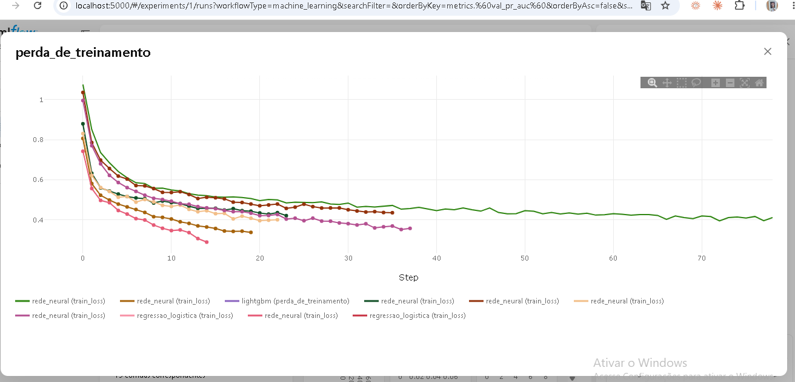
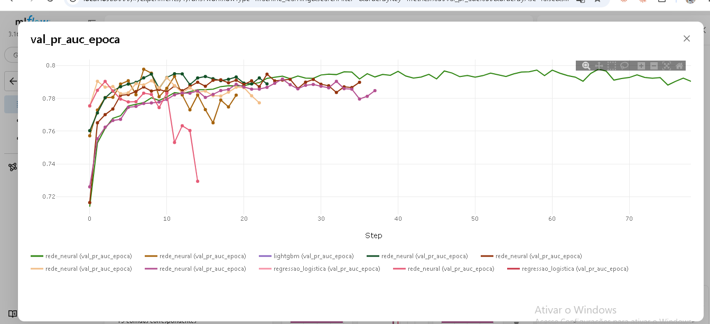

# Assistente de Churn B2B

Prevê quais clientes de uma distribuidora vão **parar de comprar**, explica **por quê** e, nas próximas etapas, recomenda **a ação de retenção certa** usando RAG + LLM, com o pipeline em produção (MLOps).

> Dados **100% fictícios**, simulados para uma distribuidora de alimentos do oeste do Paraná (2.500 clientes, ~190 mil pedidos, 30 meses).

```
[Pedidos, atendimentos, cadastro] ─> Atributos por cliente ─> Modelo de churn ─> SHAP (motivos)
                                                                             │
[Políticas de retenção] ─> RAG (ChromaDB) ──────────────────────────────────┼─> LLM: plano de ação
                                                                             │
                                FastAPI + Docker + MLflow + GitHub Actions + Evidently (drift)
```

## Status

| Etapa | Conteúdo | Status |
|---|---|---|
| 1 | Dados, atributos, 3 modelos comparados, MLflow, SHAP | ✅ concluída |
| 2 | RAG: base de políticas de retenção + ChromaDB | ⏳ |
| 3 | LLM (LangChain) + API FastAPI + tela Streamlit | ⏳ |
| 4 | MLOps: Docker, GitHub Actions, deploy, monitoramento de drift | ⏳ |

## O problema: churn em B2B não tem "cancelamento"

Cliente de distribuidora não cancela contrato: ele **vai comprando menos até sumir**. Por isso a definição é:

> **Churn** = cliente ativo (comprou nos últimos 90 dias) que **não compra nos 90 dias seguintes**.

O modelo olha o retrato do cliente numa data e responde: *qual a chance de ele parar de comprar no próximo trimestre?*

## Etapa 1: resultados

Divisão **temporal** (treino em 2024-25, validação e teste em períodos posteriores que o modelo nunca viu), para simular o uso real.

| Modelo | PR-AUC teste | ROC-AUC teste | Lift top 10% | Recall top 10% |
|---|---|---|---|---|
| Rede neural (PyTorch) | 0,718 | 0,928 | 7,2× | 72% |
| LightGBM | 0,737 | 0,926 | 7,5× | 75% |
| Regressão logística | 0,709 | 0,925 | 7,1× | 71% |

**O que isso quer dizer na prática:** olhando só os 10% de clientes com maior risco, a equipe comercial encontra cerca de **3 em cada 4 clientes que vão sair**.

**Decisões e aprendizados**

- **PR-AUC como métrica principal**: só ~8% dos clientes saem por trimestre, e a acurácia enganaria.
- **A rede neural venceu na validação, mas o LightGBM foi melhor no teste.** Os três ficaram próximos, um resultado comum em dados tabulares. A escolha é feita pela validação, para não "espiar" o teste, e a comparação completa fica registrada no MLflow.
- **Calibração (Platt)**: o treino usa pesos para a classe rara, o que infla as probabilidades. Depois de calibrar, "risco de 30%" significa ~30% de chance real (Brier 0,041).
- **Sem vazamento**: há um teste automatizado que altera dados futuros e garante que os atributos não mudam.
- **Explicações conferidas**: como os dados são simulados, existe o gabarito da causa real. Em **87%** dos churns de teste com causa conhecida (entrega, preço ou financeiro), a causa real aparece entre os 3 motivos que o SHAP aponta.


### Treino × validação: detectando overfitting

| Erro de treino por época | PR-AUC de validação por época |
|---|---|
|  |  |

A configuração rosa continua baixando o erro de treino, mas a validação despenca após a época 2: é overfitting. O early stopping interrompe o treino e recupera os pesos da melhor época.

### Exemplo de saída (`data/scores_atuais.csv`)

| Cliente | Risco | Motivos |
|---|---|---|
| C00700 · Mercearia · Palotina | Alto | Atraso médio de pagamento de 16 dias · Última compra há 69 dias |
| C01699 · Hotel · Cascavel | Alto | Última compra há 81 dias · Atraso médio de pagamento de 19 dias · Só 1 pedido em 90 dias |

Cada motivo recebe um **tema** (entrega, preço, financeiro, produto, engajamento, relacionamento), que na Etapa 2 vai buscar a política de retenção certa no RAG.

## Como rodar

```bash
python -m venv .venv
.venv\Scripts\activate            # Windows  (Linux/Mac: source .venv/bin/activate)
pip install -r requirements.txt

python -m churn_b2b.simulacao      # gera os dados em data/            (~10 s)
python -m churn_b2b.treinar        # treina e compara os modelos       (~1 min)
python -m churn_b2b.pontuar        # pontua a carteira atual + motivos (~15 s)
pytest                             # testes

mlflow ui --backend-store-uri sqlite:///mlflow.db   # abre http://localhost:5000
```

## Estrutura

```
churn_b2b/
  config.py       datas de corte, caminhos, MLflow
  simulacao.py    gera clientes, pedidos e atendimentos (com causas de churn e drift proposital)
  features.py     retrato do cliente na data de corte + rótulo (sem vazamento)
  modelos.py      regressão logística, LightGBM, rede neural PyTorch (early stopping), calibração
  treinar.py      busca de hiperparâmetros, MLflow, seleção, relatório
  explicar.py     SHAP → motivos em português + tema de retenção
  pontuar.py      risco, faixa e motivos da carteira atual
tests/            vazamento, rótulo, treino e explicação
reports/          métricas e curva PR
models/           modelo campeão + metadata.json
```

## Sobre a simulação

Cada cliente tem fatores ocultos (sensibilidade a preço, risco financeiro, distância do CD). Quem vai sair recebe uma causa (serviço, preço, financeiro ou "silencioso"), e nos meses anteriores aparecem sinais coerentes com ela. Para o problema não ficar fácil demais, há churns silenciosos (sem aviso) e clientes que esfriam por um tempo e voltam (falsos alarmes). Nos 3 últimos meses há um **choque logístico nas cidades distantes**, de propósito, para o monitoramento de drift detectar na Etapa 4.

---
Autor: João Carlos · Cascavel/PR
