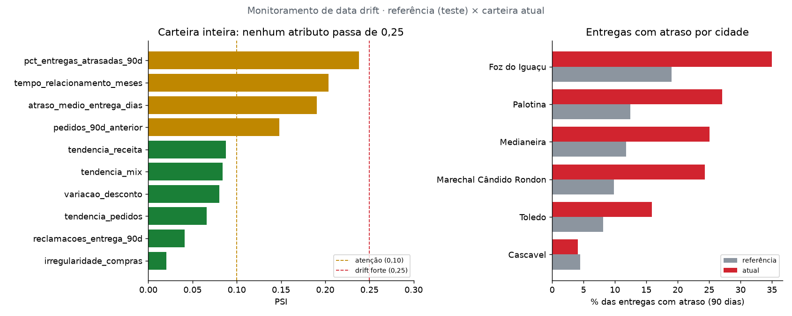

# Monitoramento de data drift

Referência: conjunto de teste (3.118 retratos) · Atual: carteira em 2026-10-01 (1.392 clientes).

**Atributos com drift forte (PSI > 0.25): 0** · atenção: 4

> ⚠️ **Recomendação: investigar e re-treinar o modelo.** Drift forte em atraso_medio_entrega_dias em 5 cidade(s): Foz do Iguaçu, Marechal Cândido Rondon, Medianeira, Palotina, Toledo; pct_entregas_atrasadas_90d em 5 cidade(s): Foz do Iguaçu, Marechal Cândido Rondon, Medianeira, Palotina, Toledo.

## Visão global (carteira inteira)

| atributo                    | tipo     |   psi |   media_referencia |   media_atual | status     |
|:----------------------------|:---------|------:|-------------------:|--------------:|:-----------|
| pct_entregas_atrasadas_90d  | numérico | 0.238 |              0.086 |         0.146 | 🟠 atenção |
| tempo_relacionamento_meses  | numérico | 0.204 |             41.185 |        44.984 | 🟠 atenção |
| atraso_medio_entrega_dias   | numérico | 0.191 |              0.259 |         0.437 | 🟠 atenção |
| pedidos_90d_anterior        | numérico | 0.148 |             12.027 |        13.187 | 🟠 atenção |
| tendencia_receita           | numérico | 0.088 |              0.191 |         0.08  | 🟢 estável |
| tendencia_mix               | numérico | 0.084 |              0.002 |         0.003 | 🟢 estável |
| variacao_desconto           | numérico | 0.081 |              0.067 |         0.008 | 🟢 estável |
| tendencia_pedidos           | numérico | 0.066 |              0.167 |         0.055 | 🟢 estável |
| reclamacoes_entrega_90d     | numérico | 0.041 |              0.472 |         0.692 | 🟢 estável |
| irregularidade_compras      | numérico | 0.02  |              0.962 |         0.973 | 🟢 estável |
| itens_por_pedido_90d        | numérico | 0.019 |             10.213 |        10.256 | 🟢 estável |
| atraso_medio_pagamento_dias | numérico | 0.013 |              1.779 |         1.61  | 🟢 estável |

## Visão por cidade (atributos em atenção)

O PSI global pode esconder um problema localizado. Por cidade (5 faixas, por causa da amostra menor):

| cidade                  | atributo                   |   psi |   clientes_atuais | status         |
|:------------------------|:---------------------------|------:|------------------:|:---------------|
| Foz do Iguaçu           | pct_entregas_atrasadas_90d | 1.187 |               149 | 🔴 drift forte |
| Palotina                | atraso_medio_entrega_dias  | 1.164 |               114 | 🔴 drift forte |
| Foz do Iguaçu           | atraso_medio_entrega_dias  | 1.148 |               149 | 🔴 drift forte |
| Marechal Cândido Rondon | pct_entregas_atrasadas_90d | 1.127 |               116 | 🔴 drift forte |
| Palotina                | pct_entregas_atrasadas_90d | 1.1   |               114 | 🔴 drift forte |
| Medianeira              | pct_entregas_atrasadas_90d | 1.05  |                89 | 🔴 drift forte |
| Marechal Cândido Rondon | atraso_medio_entrega_dias  | 0.915 |               116 | 🔴 drift forte |
| Medianeira              | atraso_medio_entrega_dias  | 0.766 |                89 | 🔴 drift forte |
| Toledo                  | pct_entregas_atrasadas_90d | 0.636 |               266 | 🔴 drift forte |
| Toledo                  | atraso_medio_entrega_dias  | 0.49  |               266 | 🔴 drift forte |

## Entregas atrasadas por cidade (% dos pedidos, últimos 90 dias)

| cidade                  |   referência (%) |   atual (%) |
|:------------------------|-----------------:|------------:|
| Foz do Iguaçu           |             19   |        35   |
| Palotina                |             12.5 |        27.1 |
| Medianeira              |             11.8 |        25   |
| Marechal Cândido Rondon |              9.9 |        24.3 |
| Toledo                  |              8.1 |        15.9 |
| Cascavel                |              4.4 |         4.1 |

