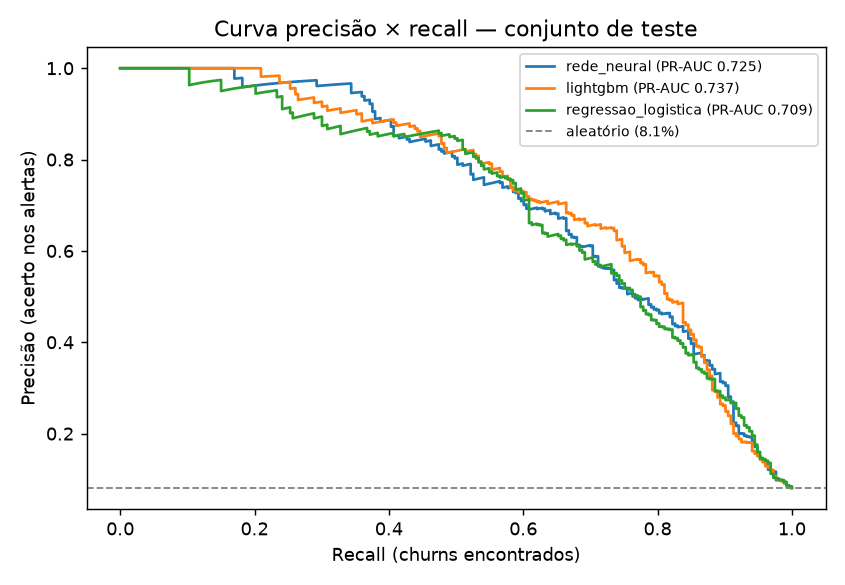

# Resultado do treino

Modelo escolhido: **rede_neural** (maior PR-AUC na validação).

Taxa de churn no teste: 8.1%. PR-AUC é a métrica principal porque a classe é rara.

| modelo              |   val_pr_auc |   teste_pr_auc |   teste_roc_auc |   teste_lift_top10 |   teste_recall_top10 |   teste_brier |
|:--------------------|-------------:|---------------:|----------------:|-------------------:|---------------------:|--------------:|
| rede_neural         |        0.798 |          0.725 |           0.926 |              7.11  |                0.711 |         0.04  |
| lightgbm            |        0.797 |          0.737 |           0.926 |              7.505 |                0.751 |         0.038 |
| regressao_logistica |        0.791 |          0.709 |           0.925 |              7.071 |                0.708 |         0.04  |

- **lift_top10**: quantas vezes o top 10% de risco concentra mais churn que a média.
- **recall_top10**: % dos churns encontrados olhando só os 10% de maior risco.

